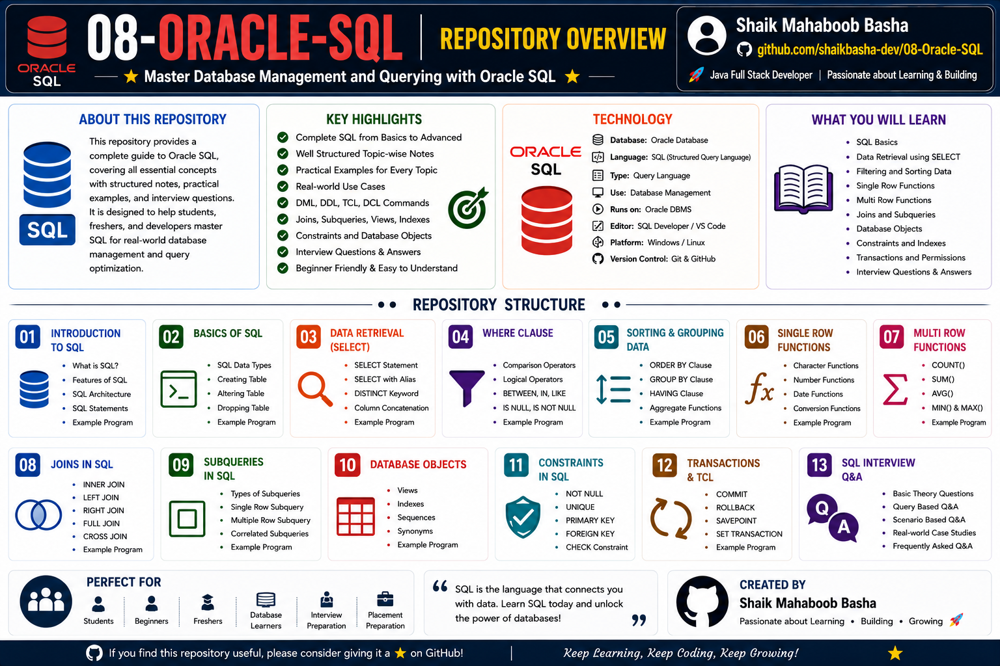

# Oracle SQL

## Overview

This repository contains comprehensive notes, SQL queries, examples, database concepts, and interview preparation materials on **Oracle SQL**.

Oracle SQL is a widely used relational database language for managing, retrieving, and manipulating data. This repository follows a beginner-to-advanced learning path and covers SQL fundamentals, data retrieval, database objects, joins, subqueries, ER diagrams, normalization, and relational model queries.

The content is organized with:

* Theory and detailed explanations
* SQL syntax and queries
* Practical examples
* Tabular outputs
* Database concepts
* Interview-oriented explanations
* Structured revision material

The primary goal of this repository is to build strong Oracle SQL and database fundamentals for Java Full Stack Development, placement preparation, and technical interviews.

## Repository Overview

## Repository Structure

### 01 - Introduction to Oracle SQL

This section introduces Oracle SQL and fundamental database concepts.

Topics Covered:

* Introduction to Oracle SQL
* Features of Oracle SQL
* SQL Categories
* SQL Execution Process
* Basic SQL Concepts

### 02 - Oracle SQL Datatypes

This section explains commonly used Oracle SQL datatypes.

Topics Covered:

* Character Datatypes
* Numeric Datatypes
* Date Datatypes
* VARCHAR2
* NUMBER
* CHAR
* DATE
* Datatype Syntax
* Practical Examples

### 03 - Retrieving Data - SELECT Statement

This section explains data retrieval using the SELECT statement.

Topics Covered:

* SELECT Statement
* Displaying All Columns
* Displaying Specific Columns
* Expressions
* SELECT Syntax
* Query Examples

### 04 - Case Sensitivity in Oracle SQL

This section explains case sensitivity rules and comparison behavior in Oracle SQL.

Topics Covered:

* Case Sensitivity Rules
* Uppercase Comparisons
* Lowercase Comparisons
* SQL Best Practices
* Practical Examples

### 05 - Constraints in Oracle SQL

This section explains database constraints used to maintain data integrity.

Topics Covered:

* NOT NULL
* UNIQUE
* PRIMARY KEY
* FOREIGN KEY
* CHECK
* DEFAULT
* Constraint Examples

### 06 - Tables in Oracle SQL

This section covers commonly used sample database tables and their structures.

Topics Covered:

* EMP Table
* DEPT Table
* J_GRADE Table
* Table Structures
* Sample Data
* Table-Based Query Practice

### 07 - Operators in Oracle SQL

This section explains operators used in Oracle SQL queries.

Topics Covered:

* Arithmetic Operators
* Relational Operators
* Logical Operators
* Special Operators
* Operator Examples

### 08 - Column Aliases, Relational and Concatenation Operators

This section explains aliases and operators used to improve and combine query output.

Topics Covered:

* Column Aliases
* Concatenation Operator
* Relational Operators
* Query Examples

### 09 - Dual Table and Complex Concatenations

This section explains the Oracle DUAL table and complex concatenation expressions.

Topics Covered:

* DUAL Table
* Concatenation
* Complex Expressions
* Query Examples

### 10 - Keywords as Operators

This section explains SQL keywords commonly used for filtering data.

Topics Covered:

* DISTINCT
* BETWEEN
* NOT BETWEEN
* IN
* NOT IN
* IS NULL
* IS NOT NULL

### 11 - LIKE Operator and Logical Operators

This section explains pattern matching and logical query conditions.

Topics Covered:

* LIKE Operator
* Percentage Wildcard (%)
* Underscore Wildcard (_)
* Pattern Matching
* AND Operator
* OR Operator
* Operator Precedence

### 12 - ORDER BY Clause

This section explains sorting query results using the ORDER BY clause.

Topics Covered:

* ASC Sorting
* DESC Sorting
* Sorting Numbers
* Sorting Dates
* Query Examples

### 13 - Functions

This section covers commonly used Oracle SQL functions.

Topics Covered:

* Single Row Functions
* Character Functions
* Number Functions
* Date Functions
* Conversion Functions
* Aggregate Functions
* COUNT()
* MIN()
* MAX()
* SUM()
* AVG()

### 14 - GROUP BY Clause

This section explains grouping rows and performing aggregate calculations.

Topics Covered:

* GROUP BY Clause
* MIN()
* MAX()
* COUNT()
* Aggregate Functions
* Grouping Examples

### 15 - HAVING Clause

This section explains filtering grouped query results using the HAVING clause.

Topics Covered:

* HAVING Clause
* Aggregate Filtering
* GROUP BY with HAVING
* ORDER BY with HAVING

### 16 - Subqueries - Nested Queries

This section explains nested queries and different subquery types.

Topics Covered:

* Single Row Subqueries
* Multi Row Subqueries
* Nested Queries
* IN Operator
* Subquery Examples

### 17 - Joins

This section explains combining data from multiple relational database tables.

Topics Covered:

* Inner Join
* Equi Join
* Natural Join
* Left Outer Join
* Right Outer Join
* Full Outer Join
* Cross Join
* Cartesian Join
* Self Join

### 18 - SQL Commands

This section explains the major SQL command categories.

#### DDL - Data Definition Language

* CREATE
* ALTER
* TRUNCATE
* DROP

#### DML - Data Manipulation Language

* INSERT
* UPDATE
* DELETE

#### TCL - Transaction Control Language

* COMMIT
* ROLLBACK
* SAVEPOINT

#### DCL - Data Control Language

* GRANT
* REVOKE

#### DQL - Data Query Language

* SELECT

### 19 - Miscellaneous Queries

This section contains commonly asked and practical Oracle SQL queries.

Topics Covered:

* REPLACE()
* CASE Statement
* Top N Queries
* Second Highest Salary
* UNION
* INTERSECT
* MINUS

### 20 - Database Objects

This section explains important Oracle database objects.

Topics Covered:

* Views
* Indexes
* Stored Procedures
* Triggers
* Sequences
* Synonyms

### 21 - Difference Between Oracle and MySQL

This section compares Oracle Database and MySQL concepts.

Topics Covered:

* Database Architecture
* Datatypes
* Date Formats
* NULL Handling
* Case Sensitivity
* Multiple Databases

### 22 - ER Diagrams and ER Schema

This section explains Entity Relationship concepts and database modeling.

Topics Covered:

* Entity
* Attributes
* Types of Attributes
* Weak Entity
* Strong Entity
* Relationships
* Cardinality Ratios
* ER Schema
* University Database ER Diagram

### 23 - Normalization

This section explains relational database normalization and data design concepts.

Topics Covered:

* Normalization
* Spurious Tuples
* Anomalies
* Data Redundancy
* Determinant
* Functional Dependency

### 24 - Relational Model Assignment Queries

This section contains practical relational database query exercises.

Topics Covered:

* STATION Table Queries
* CITY Table Queries
* COUNTRY Table Queries
* Employee Queries
* Aggregate Queries
* JOIN Queries

## Features of This Repository

This repository provides:

* Beginner to advanced Oracle SQL concepts
* Well-structured learning path
* Theory with detailed explanations
* SQL syntax and practical examples
* Industry-oriented SQL queries
* Tabular query outputs
* Data retrieval and filtering concepts
* Single row and aggregate functions
* Joins and subqueries
* Database objects
* SQL constraints
* SQL command categories
* ER diagrams and ER schema
* Normalization concepts
* Relational model queries
* Interview-oriented content
* Suitable for revision and technical interviews

## Technologies Used

* Oracle SQL
* Oracle Database
* Structured Query Language (SQL)
* Relational Database Management System (RDBMS)
* PL/SQL Basics
* Git
* GitHub
* Markdown

## Interview Preparation

The concepts in this repository support interview preparation for:

* SQL Fundamentals
* Oracle SQL Datatypes
* SELECT Queries
* SQL Operators
* WHERE and Filtering Concepts
* ORDER BY
* Single Row Functions
* Aggregate Functions
* GROUP BY
* HAVING
* Subqueries
* SQL Joins
* DDL, DML, TCL, DCL, and DQL
* Database Objects
* Constraints
* ER Diagrams
* Normalization
* Relational Database Concepts
* Frequently Asked SQL Queries

The interview preparation content is structured to strengthen SQL and database concepts for Java Full Stack Developer and database-related technical interviews.

## Purpose

This repository is created to:

* Build strong Oracle SQL concepts
* Learn SQL from basic to advanced topics
* Practice industry-oriented SQL queries
* Understand relational database management
* Learn data retrieval, filtering, sorting, and grouping
* Understand joins and subqueries
* Learn database objects and constraints
* Understand ER diagrams and database modeling
* Learn normalization concepts
* Practice relational model queries
* Prepare for SQL and database technical interviews
* Strengthen Java Full Stack Developer database skills
* Maintain structured Oracle SQL learning notes
* Support quick revision and placement preparation

## Repository Highlights

* 24 structured Oracle SQL sections
* Theory, SQL queries, and outputs
* Beginner-to-advanced learning path
* Data retrieval and filtering
* SQL operators and functions
* GROUP BY and HAVING
* Joins and subqueries
* SQL command categories
* Database objects
* Constraints and data integrity
* ER diagrams and ER schema
* Normalization
* Relational model queries
* Industry-oriented SQL concepts
* Interview-oriented content

## Who Can Use This Repository

This repository is useful for:

* Beginners learning SQL
* Oracle SQL learners
* Database learners
* Java Full Stack Developer aspirants
* B.Tech and degree students
* College students
* Freshers preparing for technical interviews
* Placement preparation
* SQL and database interview preparation
* Developers revising relational database concepts

## Author

**Shaik Mahaboob Basha**

B.Tech - Electronics and Communication Engineering

Aspiring Java Full Stack Developer

## Future Improvements

Additional advanced topics may include:

* PL/SQL Blocks
* Cursors
* PL/SQL Exception Handling
* Packages
* Advanced Triggers
* Advanced Stored Procedures
* Materialized Views
* Transactions in Detail
* Performance Tuning Basics
* Advanced Indexing Concepts
* SQL Interview Questions and Answers

## Support

If this repository helps you in your learning journey, interview preparation, or future reference, please consider giving it a **Star ⭐**. Your support is greatly appreciated and motivates me to continue creating high-quality educational repositories.

## Conclusion

This repository is created as a comprehensive Oracle SQL learning and database interview preparation resource. It contains SQL fundamentals, datatypes, data retrieval, operators, functions, grouping, joins, subqueries, SQL commands, database objects, constraints, ER diagrams, normalization, relational model queries, and practical SQL examples arranged in a structured manner for easy learning, revision, and technical interview preparation.

Happy Learning and Keep Coding!
